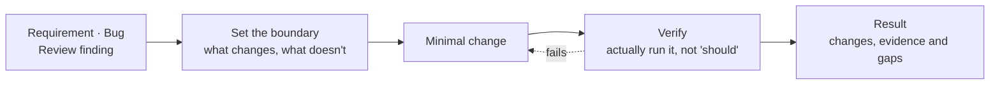

<div align="center">


# SOIA Open Dev Skills

**Stop letting the agent close a change with "should be fine"**

12 on-demand skills: set the boundary, implement, and verify actual outcomes

[中文](README.md) · English · [Ecosystem portal](https://github.com/soia-team/soia-open-skills)

<p align="center">
  
  
  
  
</p>

</div>

---

## What it solves

Choose one focused entry, read the relevant context, make a minimal complete change, and verify actual behavior. Ordinary tasks do not automatically add a panel, adversarial round, or repeated review.



## 12 skills

### 01 Change loop　`Requirement or bug → a change with scope, verification and review`

| Skill | Responsibility | Ready |
|---|---|:-:|
| [`soia-dev-enforce-coding-protocol`](skills/soia-dev-enforce-coding-protocol/SKILL.md) | Short scope, authority and risk-based verification constraints; no extra workflow | ✅ |
| [`soia-dev-implement-task`](skills/soia-dev-implement-task/SKILL.md) | One implementation flow for requirements, bugs and findings | ✅ |
| [`soia-dev-review-code`](skills/soia-dev-review-code/SKILL.md) | One read-only review of a fixed candidate; no automatic fixes or merge | ✅ |

### 02 Testing and release　`Requirement or change → test plan, release checklist, rollout gates`

| Skill | Responsibility | Ready |
|---|---|:-:|
| [`soia-dev-test-draft-doc`](https://github.com/soia-team/soia-open-skills/blob/main/docs/skills/soia-dev-test-draft-doc.md) | Generates test plans, cases and an acceptance matrix from requirements, PRDs or change notes | ✅ |
| [`soia-dev-release-plan-checklist`](https://github.com/soia-team/soia-open-skills/blob/main/docs/skills/soia-dev-release-plan-checklist.md) | Generates the release checklist, pre-flight gates, canary verification and post-release checks | ✅ |

### 03 Repository operations　`Repo as-is → consistent docs, compliant PRs, a working baseline`

| Skill | Responsibility | Ready |
|---|---|:-:|
| [`soia-dev-github-ops`](https://github.com/soia-team/soia-open-skills/blob/main/docs/skills/soia-dev-github-ops.md) | GitHub `gh` CLI operations, PR compliance review and remediation | 🟡 |
| [`soia-dev-doc-sync`](https://github.com/soia-team/soia-open-skills/blob/main/docs/skills/soia-dev-doc-sync.md) | Audits and repairs factual drift between docs, README, CHANGELOG, VERSION and the source of truth | ✅ |
| [`soia-dev-project-scaffold`](https://github.com/soia-team/soia-open-skills/blob/main/docs/skills/soia-dev-project-scaffold.md) | Generates a minimal AI-collaboration baseline for a new Git project (AGENTS.md + docs nav) | ✅ |

### 04 Terminal and multi-agent　`Long tasks and several CLIs → controlled execution and dispatch`

| Skill | Responsibility | Ready |
|---|---|:-:|
| [`soia-dev-terminal-ops`](https://github.com/soia-team/soia-open-skills/blob/main/docs/skills/soia-dev-terminal-ops.md) | Long tasks, tmux sessions, log capture, stall diagnosis; killing goes through TERM → recheck → KILL | ✅ |
| [`soia-dev-agent-cli-dispatch`](https://github.com/soia-team/soia-open-skills/blob/main/docs/skills/soia-dev-agent-cli-dispatch.md) | External AI CLI dispatch and model routing, with controlled hand-off and usage receipts | 🟡 |
| [`soia-dev-agent-md-advisor`](https://github.com/soia-team/soia-open-skills/blob/main/docs/skills/soia-dev-agent-md-advisor.md) | Advisor for AI project instructions and config: diagnosis, drafting and rewriting | ✅ |

### 05 Understanding code changes　`AI-generated code → architecture, data flow and evidence views`

| Skill | Responsibility | Ready |
|---|---|:-:|
| [`soia-dev-show-task-html`](https://github.com/soia-team/soia-open-skills/blob/main/docs/skills/soia-dev-show-task-html.md) | Explains the current topic in the smallest useful view; focused HTML only when visual complexity warrants it | ✅ |

✅ Works right after install　🟡 Needs a login or API key first; the skill tells you what is missing before it runs

## Install

Choose a host and one skill by default; an explicitly selected domain plugin includes all 12 skills.

Publishing and local installation are separate: the default is one skill for one project and one explicit host. Global, whole-domain or all-host scope requires an explicit choice and a dry-run first; publishing never syncs to local hosts automatically.

```bash
claude plugin marketplace add soia-team/soia-open-skills && claude plugin install soia-dev@soia
```

```bash
codex plugin marketplace add soia-team/soia-open-skills && codex plugin add soia-dev@soia
```

WorkBuddy is a desktop app with no CLI, so a skill does the work — tell your agent "install into WorkBuddy", or run:

```bash
python3 <soia-open-skills>/skills/soia-meta-skill-release/scripts/install_workbuddy_experts.py soia-dev
```

Restart the client, then summon **Soia · 研发工程师** under Experts → My Experts.

> For a single skill use npx: `npx skills add soia-team/soia-open-dev-skills -g -a '*' -s <skill-name> -y` — pick one route or the other; running both puts the same skill in the index twice and the copies drift apart.

## What it does not do

- **No fake fixes.** If the shortest path to a green test is editing the assertion or adding a skip, that is not a fix — the skill requires the real cause be stated.
- **No scope creep.** Drive-by refactors and formatting changes get confirmed first.
- **Does not make product decisions.** Trade-offs and priorities are yours to call.
- **Does not touch credentials.** A plaintext key found in the repo gets its location reported, not migrated or deleted.
- **No internal company process.** Industry-specific requirement, test and release standards live in private repos.

## Contributing

Before committing a skill change:

```bash
python3 -m unittest discover -s tests -p 'test_*.py' && python3 scripts/audit_skills.py --strict && python3 scripts/generate_expert_manifest.py --check
```

Full workflow in the portal's [CONTRIBUTING.md](https://github.com/soia-team/soia-open-skills/blob/main/CONTRIBUTING.md).

## License

MIT — see [LICENSE](./LICENSE).
